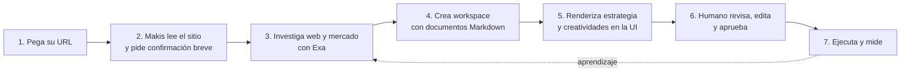

# Makis — Product Requirements Document
## Onboarding autónomo de GTM desde una URL

> **Versión:** 5.0.0 · **Hackathon:** Agents, Everywhere (AI Tinkerers 2026)
> **Equipo:** Maki Acevichado (Joel Espinoza · Diego Celis · Miluska R. · Freddy Ñañez)
> **Stack:** FastAPI · OpenAI Agents SDK · Exa Search · OpenAI Image API · Resend · SQLite · Chart.js

---

## 1. La idea

**Makis empieza donde una empresa ya existe: su sitio web.** El usuario pega una URL y, con una confirmación mínima, Makis construye un workspace de GTM listo para usar. No necesita describir su negocio desde cero ni saltar entre herramientas.

Makis lee el sitio, investiga el mercado, detecta la propuesta y los competidores, crea la estrategia y genera las primeras piezas. Todo queda organizado como documentación viva en Markdown y, al mismo tiempo, se presenta como una interfaz clara de tarjetas, vistas previas y decisiones accionables.

**Markdown conserva la fuente de verdad; la UI hace que esa verdad sea fácil de revisar y operar.**

## 2. Problema que resuelve

El onboarding de marketing suele arrancar con formularios largos, documentos dispersos y una cadena manual de investigación, estrategia, contenido, aprobación y medición. El contexto se pierde entre herramientas y el usuario no sabe qué revisar primero.

Makis reduce el problema a tres primitivas:

1. Una URL contiene evidencia inicial sobre el negocio.
2. Un agente puede convertir esa evidencia en artefactos estructurados.
3. El humano debe poder ver, corregir y aprobar cada decisión antes de ejecutar.

No es un chatbox con respuestas: es un workspace que aparece ya poblado alrededor del negocio del usuario.

## 3. Flujo principal: URL a workspace



### 3.1 URL primero

La pantalla inicial tiene un campo dominante: **“Pega el sitio de tu negocio”**. Tras ingresar la URL, el usuario solo completa lo que el sitio no puede revelar con confianza:

- objetivo de la campaña;
- presupuesto o rango de inversión;
- canal o mercado prioritario, si aplica.

Makis extrae nombre de marca, oferta, categorías, tono, llamados a la acción, señales de audiencia y activos públicos. Luego muestra una tarjeta de confirmación: “Esto es lo que entendimos de tu negocio”. El usuario puede corregirla antes de continuar.

### 3.2 Investigación y estrategia

Con el brief confirmado, el investigador consulta Exa y analiza la web para encontrar competidores, tendencias, lenguaje de la categoría y oportunidades. El estratega traduce esos hallazgos en audiencia, oferta, canales, mensajes y KPIs.

El resultado no queda encerrado en una respuesta de agente: se guarda como documentación versionada dentro del workspace.

### 3.3 Workspace autoconfigurado

Makis crea el espacio de trabajo y sus primeros artefactos:

```text
workspace/<empresa>/
├── 00-brief.md                 # negocio, objetivo y supuestos confirmados
├── 01-investigacion.md         # fuentes, competidores y hallazgos
├── 02-estrategia.md            # audiencia, oferta, canales y KPIs
├── 03-plan-de-contenido.md     # piezas, prioridades y calendario inicial
├── 04-creatividades.md         # copy, prompts y estado de aprobación
├── 05-resultados.md            # métricas, aprendizaje y próximo experimento
└── assets/                     # imágenes y archivos generados
```

Los archivos Markdown son legibles, exportables y auditables. Cada uno conserva fuentes, fecha, versión, decisiones del usuario y el estado de aprobación. SQLite mantiene el índice, versiones, relaciones entre artefactos y eventos del flujo.

### 3.4 Documentación que se ve como producto

La interfaz no expone Markdown crudo como experiencia principal. Lo renderiza según su intención:

| Documento fuente | Vista de la UI | Acción humana |
|---|---|---|
| Brief | Ficha de negocio y datos confirmados | Corregir contexto |
| Investigación | Tarjetas de competidores y evidencias | Validar hallazgos |
| Estrategia | Tablero de audiencia, oferta y KPIs | Aceptar o ajustar dirección |
| Plan de contenido | Calendario y cola de piezas | Reordenar prioridades |
| Creatividades | Editor de copy, imagen y vista previa | Editar, regenerar o aprobar |
| Resultados | Métricas, gráfico y aprendizaje | Definir el siguiente experimento |

El mismo contenido existe en dos capas: una capa durable de documentación y una capa visual para decidir rápido. Un cambio aprobado desde la UI actualiza el Markdown y crea una nueva versión; no hay una verdad paralela.

## 4. Arquitectura funcional en cinco fases

### Fase 1. Descubrimiento desde la URL

**Entrada:** URL, objetivo, presupuesto y ajustes opcionales.
**Agente:** Director.
**Salida:** `00-brief.md` y perfil de negocio pendiente de confirmación.

### Fase 2. Investigación y dirección estratégica

**Entrada:** brief confirmado.
**Agentes:** investigador y estratega.
**Salida:** `01-investigacion.md` y `02-estrategia.md`, con fuentes y supuestos visibles.

### Fase 3. Plan y creatividades

**Entrada:** estrategia aprobada.
**Agente:** creador.
**Salida:** plan de contenido, copies, secuencias de email, anuncios, prompts, imágenes y landing iniciales.

### Fase 4. Revisión y ejecución humana

**Entrada:** piezas propuestas.
**Experiencia:** edición en línea, regeneración con feedback y controles Aprobar / Editar / Rechazar.
**Salida:** artefactos aprobados y ejecución por Resend; Meta y Google Ads se muestran como mocks en el demo.

### Fase 5. Resultados y aprendizaje

**Entrada:** datos reales cuando existan o dataset simulado para el hackathon.
**Agente:** analista.
**Salida:** `05-resultados.md`, gráficos de leads, CPL, CAC y ROAS, más una recomendación para el siguiente experimento.

El aprendizaje aprobado alimenta la siguiente investigación y queda trazado en los documentos. El sistema mejora sin ocultar qué cambió ni por qué.

## 5. Experiencia de interfaz

La experiencia tiene tres momentos:

1. **Onboarding de URL:** una pantalla limpia, lectura del sitio y confirmación del perfil detectado.
2. **Cockpit de workspace:** progreso de las cinco fases, documentos convertidos en módulos visuales y una cola de decisiones.
3. **Studio de aprobación:** contenido e imágenes en contexto, edición directa y una acción explícita para aprobar o regenerar.

CopilotKit puede ofrecer ayuda contextual dentro de este cockpit, pero no es la experiencia central. El valor está en que el agente puede leer el estado real del workspace y llevar al usuario al documento o decisión que necesita, no en sostener una conversación aislada.

## 6. Arquitectura técnica

```text
makis/
├── backend/
│   ├── main.py                 # API y orquestación del onboarding
│   ├── agents/
│   │   ├── director.py         # URL -> brief verificable
│   │   ├── researcher.py       # Exa + extracción web
│   │   ├── strategist.py       # investigación -> estrategia
│   │   ├── creator.py          # contenido e imagen
│   │   └── analyst.py          # métricas -> aprendizaje
│   ├── services/
│   │   ├── workspace_store.py  # Markdown, versiones y activos
│   │   └── markdown_renderer.py# Markdown estructurado -> UI
│   ├── integrations/           # Exa, Resend y mocks de Ads
│   └── database.py             # SQLite: índice, eventos y aprobaciones
├── frontend/
│   ├── onboarding/             # URL y confirmación de perfil
│   ├── workspace/              # vistas renderizadas de documentos
│   ├── studio/                 # edición y aprobación de creatividades
│   └── analytics/              # Chart.js y próximos experimentos
├── workspaces/                 # Markdown y assets por empresa
└── data/makis.db
```

## 7. Criterios de éxito para el demo

- Una URL real o preconfigurada crea un perfil de negocio y un workspace visible en menos de un minuto.
- Al menos tres documentos Markdown se generan y se muestran como vistas de interfaz, no como texto plano.
- El usuario modifica una decisión o un copy y el cambio queda registrado en el documento fuente.
- Una creatividad se aprueba y dispara un email por Resend o una simulación explícita y confiable.
- El dashboard muestra un aprendizaje y lo vincula al siguiente experimento.

## 8. Roles del equipo

| Miembro | Responsabilidad |
|---|---|
| Joel Espinoza | Orquestación, SQLite, analítica y bucle de aprendizaje |
| Diego Celis | FastAPI, lectura de URL, Exa e investigación estructurada |
| Miluska R. | Onboarding, cockpit, renderizado de documentos y revisión humana |
| Freddy Ñañez | Arquitectura de producto, creatividades, demo y pitch |

## 9. Guion de demo de tres minutos

1. **0:00–0:25.** “No deberías describir tu empresa a un agente. Tu sitio ya contiene el comienzo del contexto.”
2. **0:25–0:55.** Pegar `makis.pe`, mostrar perfil detectado y confirmar el objetivo.
3. **0:55–1:30.** Ver cómo aparecen investigación, estrategia y plan como workspace con documentos renderizados.
4. **1:30–2:05.** Abrir una creatividad, editar una frase y aprobar. Mostrar que el cambio queda guardado en el documento y pasa a ejecución.
5. **2:05–2:35.** Mostrar resultados simulados, el aprendizaje identificado y su conexión con el siguiente experimento.
6. **2:35–3:00.** “Makis no responde desde una caja de chat. Entra por la URL de tu negocio, construye el sistema de trabajo y deja al humano gobernar cada decisión.”
